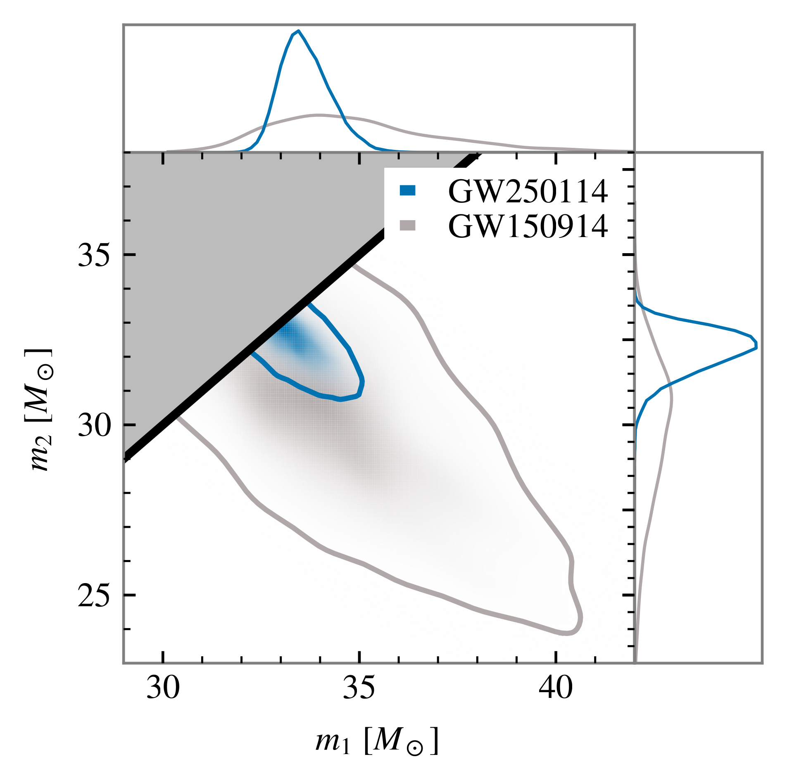

# The gravitational wave inference problem

---



---



---



---



## What kind of data do we have?

![Strain data for the GW250114 event [@abacGW250114TestingHawkings2025].](figures/Figure_1.png)

## Strain data

$$ d_i = n(i \Delta t) + h(i \Delta t; \theta, M)
$$

where typically $1/\Delta t = 4096 \text{Hz}$ or $16384 \text{Hz}$. 

The contributions are:

::: {.incremental}
- instrumental noise $n(t)$;
- gravitational wave signal $h(t; \theta, M)$, which we obtain based on a model $M$ with parameters $\theta$.
:::


## Stationary Gaussian noise model

Typical assumptions about the noise:

::: {.incremental}
- $\mathbb{E}[n(t)] = 0$,
- $\mathbb{E}[n(t) n(t + \Delta t)] = \gamma (\Delta t)$,
- $\lbrace n(t_1), \dots, n(t_N) \rbrace$ is an $N$-dimensional Gaussian random variable for any choice of times $t_1 \dots t_N$.
:::

## Glitches

![Examples of glitches in gravitational wave data [@Powell_2018].](figures/cqgaacf18f01_hr.jpg)

## Gravitational wave likelihood


In full generality:

$$ \mathcal{L}(d | \theta, M) = p(\text{noise realization } n = d - h(\theta, M) | \theta, M)
$$

. . .

With Gaussian stationary noise:

$$ \mathcal{L}(d | \theta, M) \propto \exp\left( - \frac{1}{2} \int_{f_\text{min}}^{f_\text{max}} \frac{|\tilde{d}(f) - \tilde{h}(f; \theta, M)|^2}{S_n(f)} \text{d} f \right)
$$

## Bayesian inference

$$ \underbrace{\mathcal{L}(d | \theta, M) \pi (\theta | M)}_{\text{assumptions}} = \underbrace{p(\theta | d, M) \mathcal{Z}(d | M)}_{\text{result}}
$$

{#fig-gw250114-component-masses width=50%}

## Model parameters

The signal parameters $\theta$ include:

- where is the source in the sky? how is it oriented? 
- what masses do the two objects have?
- how fast are they rotating, and in which direction?
- ...

Depending on the model, there can be 10--17 parameters.

# Simulation-based inference

## Simulating from the likelihood

In standard inference, we _evaluate_ the likelihood $\mathcal{L}(d | \theta, M)$.

In simulation-based inference, we _simulate_ data distributed according to the likelihood: 

$$ d \sim \mathcal{L} ( d | \theta, M)
$$

## Flavors of SBI 

- __Neural posterior estimation__: a density estimator $q(\theta | d)$ models the posterior $p(\theta | d)$;
- __Neural likelihood estimation__: a density estimator $q(d | \theta)$ models the likelihood (requires sampling);
- __Neural ratio estimation__: a classifier $r(\theta, d)$ models the likelihood-to-evidence ratio $\mathcal{L}(d|\theta) / \mathcal{Z}(d)$ (requires sampling).
- ...

More details: @liangRecentAdvancesSimulationbased2025.

## Neural posterior estimation in a nutshell

Take a density estimator $q_\phi (\theta | d)$ with parameters $\phi$. 
Train it with a loss function in the form [@papamakariosFastEpsilonFree2016;@daxRealtimeGravitationalwaveScience2021]

$$ L(\phi) = \mathbb{E}_{\theta \sim \pi(\theta)}
 \mathbb{E}_{d \sim p(d|\theta)}
 [-\log q_\phi(\theta|d)]\,.
$$

If training is successful, the estimator $q_{\bar{\phi}}(\theta | d)$ at $\bar{\phi} = \text{argmin}_\phi L(\phi)$ will approximate $p(\theta | d)$.

## Proof

Consider the posterior expectation of the KL divergence from posterior $p$ to the estimator $q$:

$$ D_{\text{KL}}( p || q_\phi) = \int p(\theta | d) \left[ \log p(\theta | d) - \log  q_\phi (\theta | d) \right] \text{d}\theta
$$

Averaging over all realizations of the data $d$:^[I use the notation $\overset{c}{=}$ for "equal up to an additive constant".]

$$ \mathbb{E}_{d \sim \mathcal{Z}(d)} [D_{\text{KL}}( p || q_\phi)] \overset{c}{=} \int  p(\theta | d) \mathcal{Z}(d) \left[ - \log  q_\phi (\theta | d) \right] \text{d}\theta \text{d}d
$$

## Proof

By Bayes' theorem, $p(\theta | d) \mathcal{Z}(d) = \mathcal{L}(d | \theta ) \pi(\theta)$.

. . .

We can compute the expectation value by 

:::{.incremental}
- sampling $\theta$ from the prior $\pi (\theta)$,
- simulating the data $d$ from the likelihood $\mathcal{L}(d | \theta )$.
:::

## Normalizing flows

# Toy model: nested sampling versus neural posterior estimation

## Problem setup

The example is borrowed from the [LAMPE documentation](https://lampe.readthedocs.io/stable/tutorials/npe.html).

Suppose we have a model with three parameters: $\theta \sim \pi(\theta) = \mathcal{U}([-1, 1]^3)$.

Our data is one observation of 

$$ x = \begin{pmatrix}
\theta_1 + \theta_2 \theta_3 \\
\theta_1 \theta_2 + \theta_3 
\end{pmatrix} + \varepsilon
$$

where $\varepsilon \sim \mathcal{N}^2(\mu = 0; \sigma = 0.05)$. 

## Standard approach: Nested Sampling

:::: {.columns}

::: {.column width="55%"}

```{python}
import matplotlib.pyplot as plt
import torch
import torch.optim as optim
import zuko
import numpy as np
from pathlib import Path

from itertools import islice
from lampe.data import JointLoader
from lampe.inference import NPE, NPELoss
from lampe.plots import corner, mark_point, nice_rc
from lampe.utils import GDStep
from tqdm import trange

from dynesty import DynamicNestedSampler

```

```{python}

LABELS = [r'$\theta_1$', r'$\theta_2$', r'$\theta_3$']
LOWER = -torch.ones(3)
UPPER = torch.ones(3)

prior = zuko.distributions.BoxUniform(LOWER, UPPER)

def simulator(theta: torch.Tensor) -> torch.Tensor:
    x = torch.stack([
        theta[..., 0] + theta[..., 1] * theta[..., 2],
        theta[..., 0] * theta[..., 1] + theta[..., 2],
    ], dim=-1)

    return x + 0.05 * torch.randn_like(x)

theta_star = torch.Tensor([-0.5781,  0.2448, -0.3824])
x_star = torch.Tensor([-0.6758, -0.5301])

# in principle we would simulate these as follows:

# theta_star = prior.sample()
# x_star = simulator(theta_star)

# but we fix them for reproducibility

```

```{python}
from dynesty import DynamicNestedSampler
import numpy as np

sigma_y = 0.05

x_obs = x_star.detach().numpy()

lnorm = -0.5 * (
	np.log(2 * np.pi) * 2 +
  np.log(2 * sigma_y**2))

```

```{python }
#| echo: true
#| code-line-numbers: "|1-5|8|7,9-11|13-14"

def forward_model(theta):
  return np.array([
    theta[0] + theta[1] * theta[2],
    theta[0] * theta[1] + theta[2]
  ])

def loglike(theta):
	x = forward_model(theta)
	return (
    - 0.5 * ((x-x_obs)**2).sum() 
    / sigma_y**2 + lnorm)

def prior_transform(u):
	return u*2. - 1.
```

We can then sample with [`DYNESTY`](https://dynesty.readthedocs.io/en/latest/index.html).

:::

::: {.column width="45%"}


```{python}
fname_nested = Path('./nested_sampler.pkl')

if fname_nested.exists():
	sampler = DynamicNestedSampler.restore(str(fname_nested))
else:
    sampler = DynamicNestedSampler(loglike, prior_transform, 3, nlive=2000)
    sampler.run_nested(dlogz_init=0.01)
    sampler.save(str(fname_nested))

ns_samples = sampler.results.samples_equal()

fig = corner(
    ns_samples,
    smooth=2,
    domain=(LOWER, UPPER),
    labels=LABELS,
    legend=r'$p(\theta | x^*)$',
    figsize=(5, 5),
)

mark_point(fig, theta_star)
```

:::

::::

## New approach: NPE

:::: {.columns}

::: {.column width="55%"}

```{python}

npe_args = (3, 2)
npe_kwargs = {
    'transforms': 3, 
    'hidden_features': [64] * 3
}

from pathlib import Path
path = Path('./npe_estimator.plk')

if path.exists():
    estimator = NPE(*npe_args, **npe_kwargs)
    estimator.load_state_dict(torch.load(path))
else:
    estimator = NPE(*npe_args, **npe_kwargs)

    loss = NPELoss(estimator)
    loader = JointLoader(prior, simulator, batch_size=256, vectorized=True)

    optimizer = optim.Adam(estimator.parameters(), lr=1e-3)
    step = GDStep(optimizer, clip=1.0)  # gradient descent step with gradient clipping

    estimator.train()

    for epoch in (bar := trange(64, unit='epoch')):
        losses = []

        for theta, x in islice(loader, 256):
            losses.append(step(loss(theta, x)))

        bar.set_postfix(loss=torch.stack(losses).mean().item())

    torch.save(estimator.state_dict(), path)

_ = estimator.eval()
```

```{python}

with torch.no_grad():
    samples = estimator.flow(x_star).sample((2**16,))
    flow_density = estimator.forward(samples, x_star)
```

```{.python}
estimator = NPE(*args, **kwargs)
loss = NPELoss(estimator)
loader = JointLoader(prior, simulator)

optimizer = optim.Adam(
  estimator.parameters())
step = GDStep(optimizer)

for epoch in range(64):
  losses = []
  for theta, x in islice(loader, 256):
      losses.append(
        step(loss(theta, x)))

samples = (estimator.flow(x_obs)
  .sample((2**16,))
)
```

:::

::: {.column width="45%"}

```{python}

fig = corner(
    samples,
    smooth=2,
    domain=(LOWER, UPPER),
    labels=LABELS,
    legend=r'$p_\phi(\theta | x^*)$',
    figsize=(5, 5),
)

mark_point(fig, theta_star)
```

:::

::::

## Validating the NPE results


```{python}
def log_prior(sample):
    if np.all(abs(sample) < 1.):
      return np.log(1/8.)
    else:
      return -np.inf
```

```{python}
#| echo: true

def effective_samples(samples):

    log_like_times_prior = [
        loglike(sample) + log_prior(sample)
        for sample in samples
    ]

    ln_weights = log_like_times_prior - flow_density.detach().numpy()
    weights = np.exp(ln_weights - np.max(ln_weights))
    n_eff = weights.sum()**2 / (weights**2).sum()
    return weights, n_eff

sbi_samples = samples.detach().numpy()
weights, n_eff = effective_samples(sbi_samples)
```

```{python}
from IPython.display import Markdown

Markdown(f"""We have {len(sbi_samples)} samples
but only {n_eff:.0f} effective samples.
""")
```

## Weighted posterior

::: {.panel-tabset}

### NPE

```{python}
#| fig-align: center

fig = corner(
    samples,
    smooth=2,
    domain=(LOWER, UPPER),
    labels=LABELS,
    legend=r'$p_\phi(\theta | x^*)$',
    figsize=(4.8, 4.8),
)

mark_point(fig, theta_star)
```


### Weighted NPE

```{python}
#| fig-align: center

fig = corner(
    samples,
    weights=weights,
    smooth=2,
    domain=(LOWER, UPPER),
    labels=LABELS,
    legend=r'Reweighted $p_\phi(\theta | x^*)$',
    figsize=(4.8, 4.8),
)

mark_point(fig, theta_star)
```

### Nested sampling

```{python}
#| fig-align: center

fig = corner(
    ns_samples,
    smooth=2,
    domain=(LOWER, UPPER),
    labels=LABELS,
    legend=r'$p(\theta | x^*)$',
    figsize=(4.8, 4.8),
)

mark_point(fig, theta_star)
```

:::

## Weighted samples comparison

::: {.panel-tabset}

### NPE

```{python}

plt.scatter(
    samples[:, 0],
    samples[:, 2],
    s=.3,
    alpha=.1,
)
plt.axvline(-1, lw=.3, c='k')
plt.axhline(-1, lw=.3, c='k')

```

### Weighted NPE

```{python}

plt.scatter(
    samples[:, 0],
    samples[:, 2],
    s=weights*100,
    alpha=.1,
)
plt.axvline(-1, lw=.3, c='k')
plt.axhline(-1, lw=.3, c='k')
```

:::

# Back to gravitational waves

## Sample efficiency

![Sample efficiency as a function of SNR [@santoliquidoComparingNextgenerationDetector2025].](figures/SNR_vs_sample_efficiency_cropped.png)

## References {.scrollable}